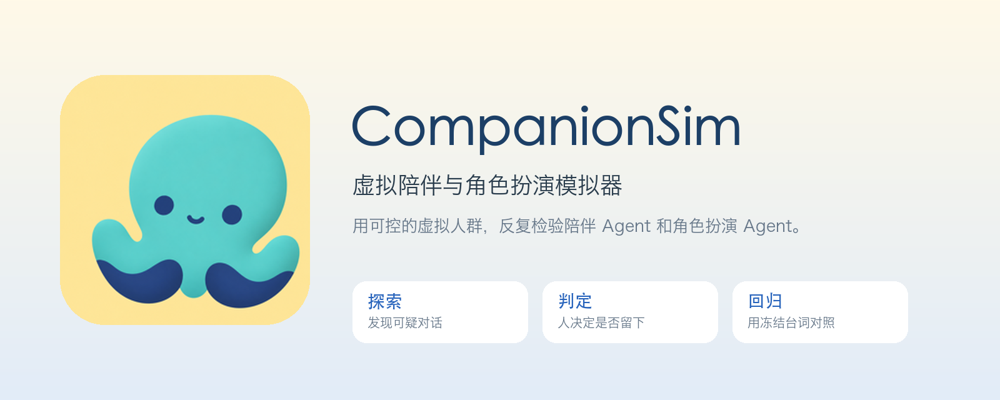
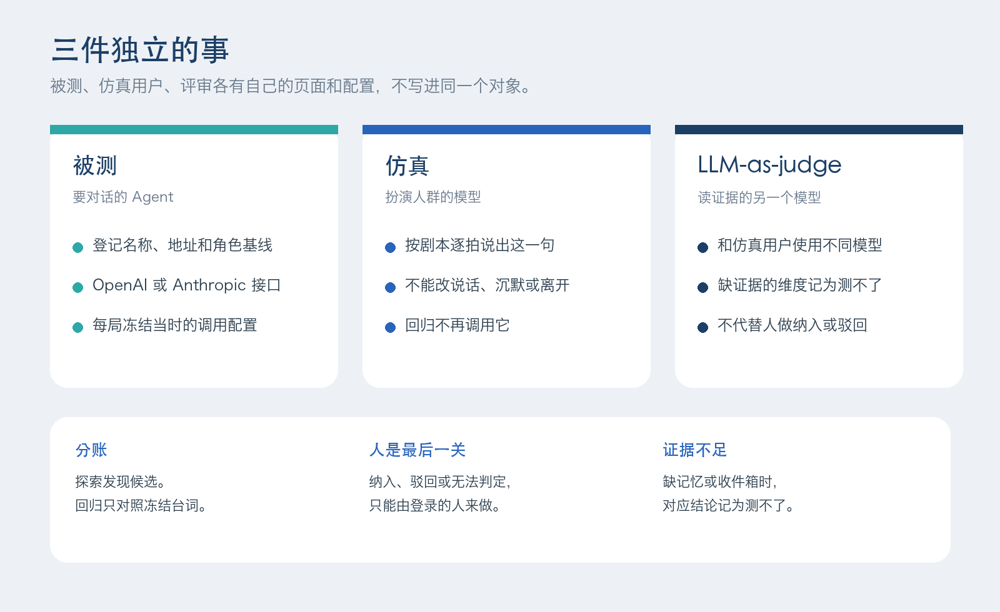
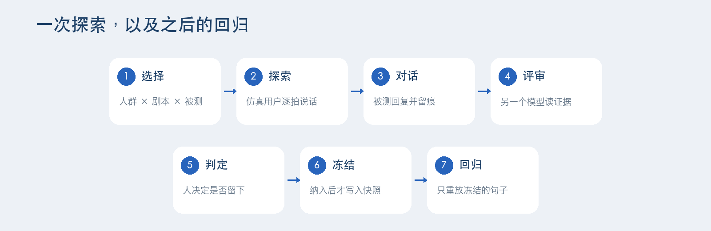
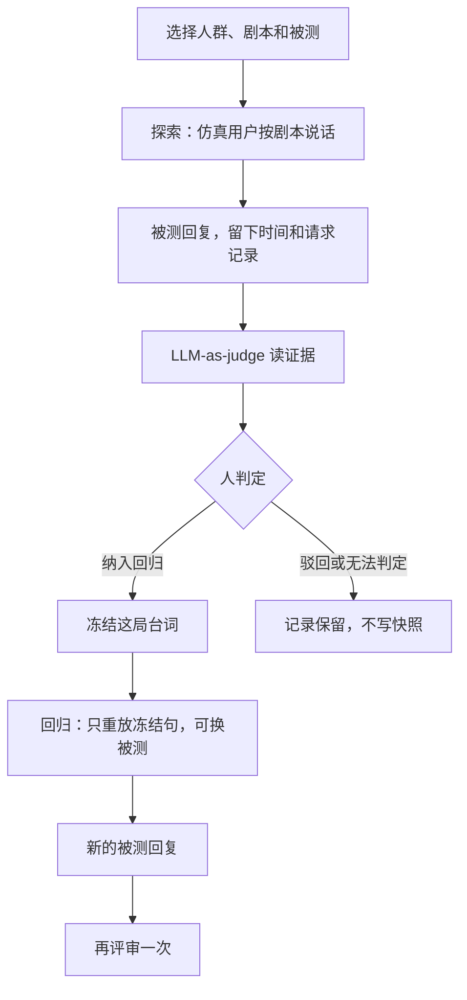

<p align="center">
  
</p>

CompanionSim 用可控的虚拟人群和剧本，让一个仿真用户与被测 Agent 对话，再由另一个模型读证据。人决定哪几局对话值得留下。留下的台词被冻结，用来做版本回归。

仿真对话不进入训练，也不作为发版门禁。

许可证：[Apache-2.0](LICENSE)。

## 它在做什么

<p align="center">
  
</p>

| 页面 | 管什么 |
| --- | --- |
| 被测 | 要对话的 Agent。可以是内置样例，或一条 OpenAI / Anthropic 兼容接口 |
| 仿真 | 扮演人群、按剧本逐拍说话的模型。回归不再调用它 |
| LLM-as-judge | 对话结束后读证据的另一个模型。不能代替人做判定 |

人群和剧本分开保存，改人会留下旧版本。探索时台词当场生成；只有人选择「纳入回归」之后，平台才把这局台词写成快照。

## 怎么走一遍

<p align="center">
  
</p>



回归路径不调用仿真用户。评审失败可以只重试评审，不必重跑对话。

## 5 分钟跑起来

需要 Docker。`docker-compose.yml` 里是一个应用进程加 MySQL 8，端口 **5260**。里面的数据库口令和 `ADMIN_PASSWORD` 是本机示例，不要拿到公网上用。

```bash
docker compose up --build
```

浏览器打开 <http://localhost:5260>，用 compose 里的 `ADMIN_USERNAME` 和 `ADMIN_PASSWORD` 登录。没有自助注册。管理员可以在「管理」页创建其他账号。

第一次可以先选内置样例 `fixture` 把流程跑通，不必先接外部模型。

## 本地开发

前置：**Node.js ≥ 20**，本机 **MySQL 8**。

```bash
npm install
cp config/platform.example.json config/platform.json
npm run admin-password -- '请换成你的密码'
```

把命令输出的哈希写入 `config/platform.json` 的 `superadmin.passwordHash`，并填好其中的 `mysql`。然后：

```bash
npm run db:migrate
npm run dev
```

打开 <http://localhost:5260>。

模型密钥放在环境变量或 `.env.local`。这个文件已被忽略，不要提交。变量名与配置里的 `${ENV}` 一致，模板见 [`.env.example`](.env.example)。

## 接上你的 Agent 和模型

被测、仿真用户、评审都是可配置的 HTTP 连接，写在 `config/suts.json`。`api` 取 `openai`（Chat Completions）或 `anthropic`（Messages）。密钥写成 `${ENV}`。

- 仿真用户的模型和连接在 `config/fake-user.json`
- 评审的模型和连接在 `config/judge.json`

两边应当使用不同的模型。改这三份配置需要管理员。

登录后可以在「我的」页签发 API Key，交给本地 Agent。Key 可以读取、提交素材和发起运行，不能做纳入回归或驳回，也不能改被测和模型配置。人群和剧本的写法见 [编排规范](docs/agent-spec.md)，也可以用仓库里的 [companionsim-author](.cursor/skills/companionsim-author/SKILL.md)。

## 本版不做

- 不把仿真时钟注入被测的「现在」。时间只用来标注对话先后。
- 不把异常对话自动聚类。人直接看待审队列。
- 被测没有记忆或收件箱接口时，对应维度记为测不了，不记成通过。
- 应用是单进程。同一记忆域内的运行串行执行。

## 文档

| 文档 | 内容 |
| --- | --- |
| [架构](docs/architecture.md) | 分层、一局仿真、数据放在哪 |
| [第一次跑通](docs/onboarding.md) | 本地管理员怎么把样例跑起来 |
| [账号与配额](docs/auth-and-roles.md) | 登录、Key、每日额度 |
| [编排规范](docs/agent-spec.md) | 人群、剧本和通道动作 |
| [运行记录](docs/run-evidence.md) | 一局留下什么 |
| [仿真用户](docs/fake-user-llm.md) | 台词怎么生成、失败怎么重试 |
| [贡献](CONTRIBUTING.md) | 测试与 PR |
| [安全](SECURITY.md) | 如何报告漏洞 |

## 许可证

[Apache License 2.0](LICENSE)。
