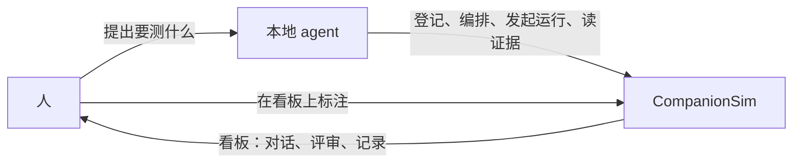
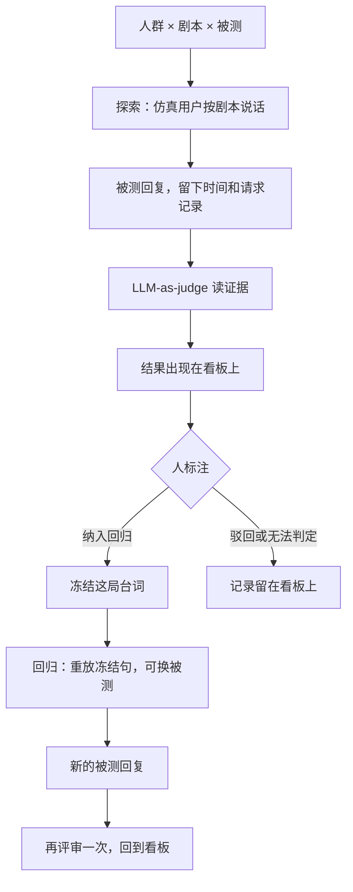

<p align="center">
  
</p>

CompanionSim 是一个 **AI Native** 的虚拟陪伴与角色扮演模拟器。

人通过自己的本地 agent 来使用它：说出要测什么人、什么场景、哪一个被测 Agent。本地 agent 负责编写人群和剧本、登记被测、发起运行、读回证据。CompanionSim 负责把这一局真正跑起来，并把对话、评审和记录放在看板上。

人回到看板上看结果，并做标注：纳入回归、驳回，或标成无法判定。传统后台里要人自己填写的大段表单和描述，在这里交给本地 agent。

许可证：[Apache-2.0](LICENSE)。

## 它在做什么

<p align="center">
  
</p>

| 页面 | 管什么 |
| --- | --- |
| 被测 | 要对话的 Agent。可以是内置样例，或一条 OpenAI / Anthropic 兼容接口 |
| 仿真 | 探索时扮演人群、按剧本逐拍说话的模型。回归沿用已经冻结的原句 |
| LLM-as-judge | 对话结束后读证据的另一个模型。纳入回归和驳回在看板上由人完成 |

人群和剧本分开保存，改人会留下旧版本。探索时台词由仿真用户当场生成。人在看板上选择「纳入回归」之后，平台把这局台词写成快照，供以后的回归使用。

## 怎么走一遍

人、本地 agent、CompanionSim 是三条线。人提出意图，也做最后的标注。本地 agent 把意图变成平台能执行的操作。CompanionSim 执行，并把结果放回看板。

<p align="center">
  
</p>



一次运行在 CompanionSim 里是这样推进的：



本地 agent 的操作说明在 [companionsim-ops](.cursor/skills/companionsim-ops/SKILL.md)。人群和剧本的写法在 [companionsim-author](.cursor/skills/companionsim-author/SKILL.md)。登录后也可以在「我的」页把这两份说明打成包交给 agent。

## 5 分钟跑起来

需要 Docker。`docker-compose.yml` 里是一个应用进程加 MySQL 8，端口 **5260**。里面的数据库口令和 `ADMIN_PASSWORD` 是本机示例，公网部署前请换成自己的。

```bash
docker compose up --build
```

浏览器打开 <http://localhost:5260>，用 compose 里的 `ADMIN_USERNAME` 和 `ADMIN_PASSWORD` 登录。账号由管理员创建。管理员在「管理」页添加其他账号。

第一次用内置样例 `fixture` 把看板和运行走通。接外部模型时，把密钥交给本地 agent，或写进 `.env.local`。

## 本地开发

前置：**Node.js ≥ 20**，本机 **MySQL 8**。

```bash
npm install
cp config/platform.example.json config/platform.json
npm run admin-password -- '请换成你的密码'
```

把命令输出的哈希写入 `config/platform.json` 的 `superadmin.passwordHash`，并填好其中的 `mysql`。然后：

```bash
npm run db:migrate
npm run dev
```

打开 <http://localhost:5260>。

模型密钥放在环境变量或 `.env.local`。这个文件已被忽略，请勿提交。变量名与配置里的 `${ENV}` 一致，模板见 [`.env.example`](.env.example)。

## 接上被测和两个模型

被测、仿真用户、评审都是可配置的 HTTP 连接，写在 `config/suts.json`。`api` 取 `openai`（Chat Completions）或 `anthropic`（Messages）。密钥写成 `${ENV}`。

- 仿真用户的模型和连接在 `config/fake-user.json`
- 评审的模型和连接在 `config/judge.json`

仿真用户和评审使用不同的模型。这三份配置由管理员维护，也可以由持有管理员会话的本地 agent 来改。

登录后在「我的」页签发 API Key，交给本地 agent。Key 用来读取、提交素材和发起运行。纳入回归、驳回，以及被测和模型配置，留在看板上由人完成。

## 文档

| 文档 | 内容 |
| --- | --- |
| [架构](docs/architecture.md) | 分层、一局仿真、数据放在哪 |
| [第一次跑通](docs/onboarding.md) | 本地管理员怎么把样例跑起来 |
| [账号与配额](docs/auth-and-roles.md) | 登录、Key、每日额度 |
| [编排规范](docs/agent-spec.md) | 人群、剧本和通道动作 |
| [运行记录](docs/run-evidence.md) | 一局留下什么 |
| [仿真用户](docs/fake-user-llm.md) | 台词怎么生成、失败怎么重试 |
| [贡献](CONTRIBUTING.md) | 测试与 PR |
| [安全](SECURITY.md) | 如何报告漏洞 |

## 许可证

[Apache License 2.0](LICENSE)。
