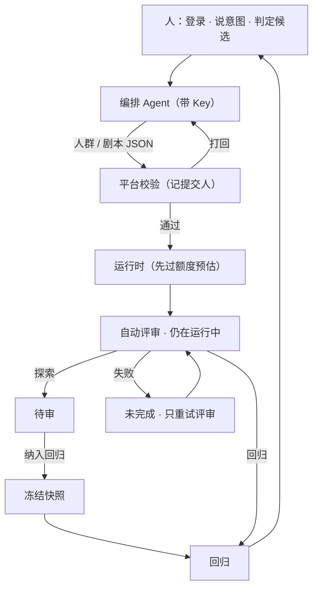
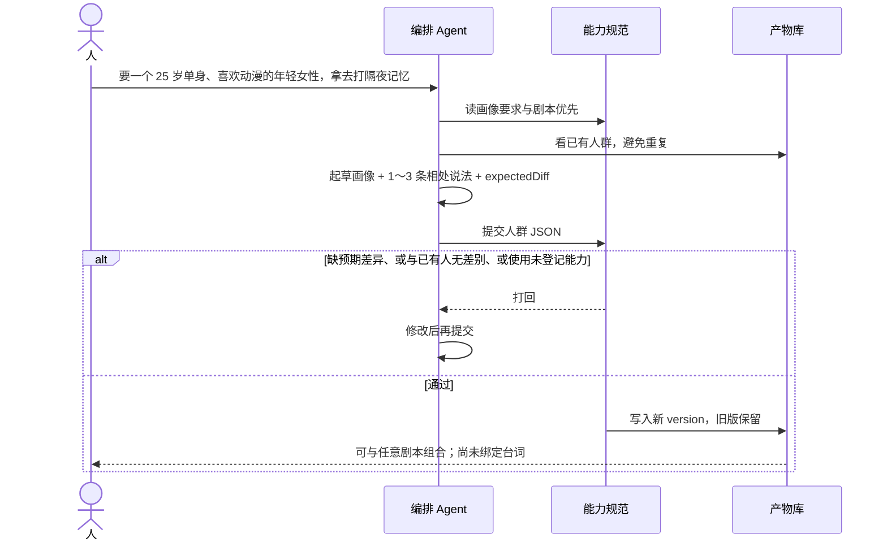
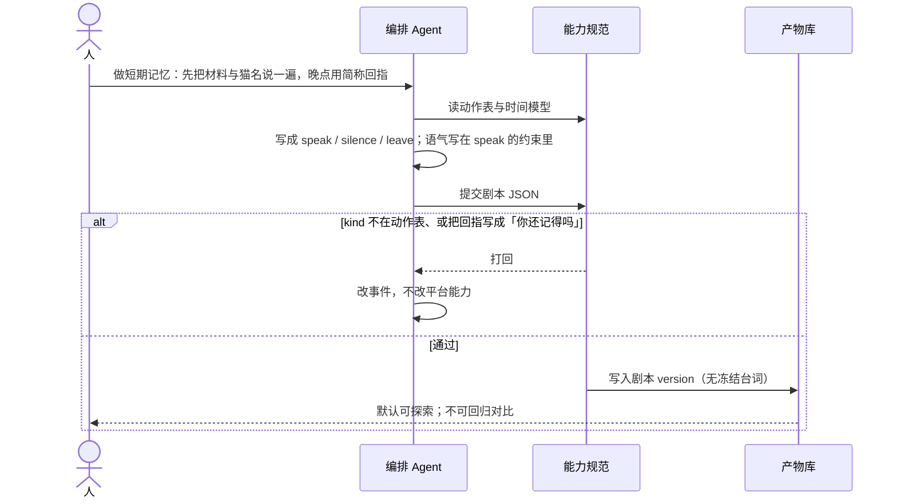
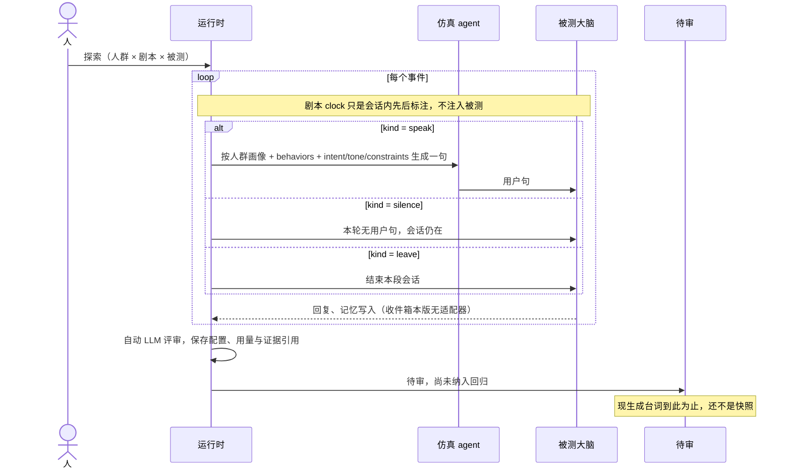
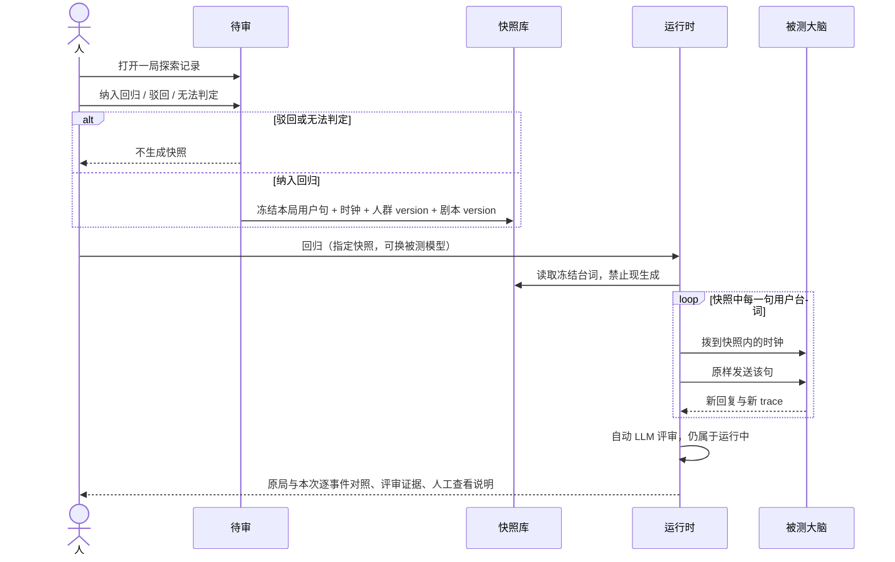

# CompanionSim · 工作流程

下列图描述当前工作流程。编排 Agent 生成材料，平台校验并运行，独立模型评审提供带证据的意见，人决定是否纳入回归。
平台要登录：人用用户名和密码，本地 agent 用 Key；每一步都记操作人，开跑前按当日 token 额度预估拦截
（见 [账号与权限](auth-and-roles.md)）。

术语：

- **探索**：现生成用户台词，搜未知失败，结果是候选。
- **待审**：这些候选构成的队列，等人判定。
- **纳入回归**：人确认会破信任，冻结台词。
- **回归**：以后用冻结台词原样再跑，对比被测版本。

## 总览：谁写、谁跑、谁判

人不必配置模板树。Agent 写不出规范外的能力。没有快照的剧本不能拿来对比版本。

---

## 1. 人群：从一句话到可复用的一类人

要点：

- 人群先是能认出来的一类人，再写 1～3 条相处说法。通道动作在剧本里。
- `expectedDiff` 是准入条件，不是文案装饰。必须能点名哪一次 `speak` 会变。
- 改画像或行为必须新 version。回归仍引用旧 version。
- 作息差、连续不回不要写成一类人；去改剧本的 `silence` / `leave`。

---

## 2. 剧本：从一句话到事件序列

要点：

- 事件是通道拍。台词属于跑局；情绪和情节属于 `speak` 的提示词约束。
- 本版只有 `speak` / `silence` / `leave` 三个动作。`jump` 已移除（假时钟没接上），
  用「下一句当第二天」也过不了校验。
- `leave` 结束会话；`silence` 人还在。本版只做一次连续时间的对话：
  跨日记忆、隔夜边界这两类考点要等假时钟接上产品。

探索时台词怎么来（剧本本身不负责写对白）：

---

## 3. 回归：只有纳入回归之后才能对比版本

要点：

- 快照的唯一合法来源：人点「纳入回归」。Agent 不准手写快照。
- 回归绑死人群 version 与剧本 version。改人设不是同一实验。
- 对比的是被测大脑，不是仿真 agent 有没有换说法。
- 本版被测只接对话。假时钟已从动作表移除、收件箱无适配器，相关结论记「测不了」或「不适用」。

---

## 已确定的交互边界

1. 创建人群 / 剧本的主路径是「对人说一句 → Agent 出 JSON → 平台校验」，界面只浏览产物、不提供字段 IDE。
2. 没有 `expectedDiff` 的人群、使用未登记动作的剧本，一律不能跑。
3. 探索默认进待审；只有纳入回归才产生可回归快照。
4. 回归时仿真 agent 不得再生成台词。

回归与探索的差别也体现在成本上：回归不调仿真 agent，只付一次评审，所以同样剧本的预估是探索的零头。

自动评审、运行快照和逐轮时间的完整语义见 [运行记录与评审契约](run-evidence.md)。探索台词现在由仿真 agent 扮演人群生成（`llm-v1`），失败重试后退避，用完预算就停下；回归仍用冻结原句。契约见 [仿真 agent 生成](fake-user-llm.md)。
