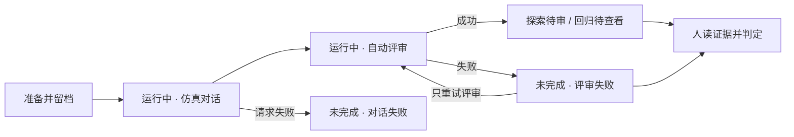

# 运行记录与评审契约

一次实验要能回答：输入是什么、实际接到谁、发生了什么、机器如何评价、人确认了什么。

## 接入与运行快照

被测页维护当前接入；运行启动后保存实际执行的同一份已解析配置，不在执行中再次按 ID 读取。包括接口、请求格式、模型、System Prompt 与指纹、采样参数、能力开关、Agent Meta，以及凭据引用或已配置状态。凭据值不进入运行记录或浏览器。

Meta 的来源分开保留：平台记录的调用配置、人工登记但未经服务验证的版本、服务返回的版本与采集时间。Meta 接口是可选项。相同 API 地址不代表远端模型、Prompt、工具或记忆状态相同。每轮可获得的返回模型、请求 ID 和远端版本另存，出现变化时标明。

每局保存人群和剧本本体；回归冻结台词时一并保存。旧记录若只有版本引用，可以查看对应版本文件，但不伪称为当时留存的本体。旧被测快照和计时缺失时不从当前配置补写。

## 自动评审与人工判定

`dialogueStatus`、`evaluationStatus`、人工 `status` 分别保存，页面组合表达。中断的对话不能显示已完成，也不能纳入回归。对话已完成但评审失败时，人工仍可读证据并判定，注明评审缺失。

每次评审追加一条 `evaluations` 记录，保留独立 Prompt、模型、rubric、输入指纹、真实起止时间、错误或结果。普通重试复用原配置；更换配置则追加新尝试，不改写过去结果或人的判断。判定记录保留说明、发言引用和所依据的评审尝试。

Judge 给每个维度提供参考分、结论、理由和可定位的发言引用；不合成总分，不自动纳入回归。仿真 agent 是否偏离人群或剧本单独判断。维度“不适用”表示本次未考察，“测不了”表示需要但缺证据；评审器调用失败显示“未评完”，不能算通过。旧关键词评分只存在于第 1 代记录，明确标为历史规则来源；新一代记录不再计算规则分。

## 时间和请求证据

| 字段 | 定义 |
| --- | --- |
| 仿真时间 | 剧本 day / clock；同时记录是否注入被测 |
| 发送时间 | 平台发出被测请求的真实 ISO 时间，含时区 |
| 首字时间 / TTFT | 从发送到第一段非空回复正文，不是响应头 |
| 总响应耗时 | 从发送到流完成或失败，不包含仿真 agent 和 Judge |
| 对话 / 评审耗时 | 各阶段独立记录 |
| 端到端耗时 | 首次运行启动至首次评审结束；重评单独计时 |

绝对时间用于对齐日志，耗时用单调时钟计算。没有采集、没有正文和失败分开记录，不填假零值。保留事件、请求尝试、HTTP 状态、结束原因、请求 ID 和返回模型。超时覆盖整个回复流。

回归沿用冻结用户句、事件与仿真时间；真实发送时间、响应时间、被测配置与评审属于本次运行。原局和本次按事件对齐。人工查看回归可以留说明，不会再次生成冻结用例。

## 当前边界

外部 SSE 接入不证明远端支持假时钟、记忆重置、收件箱或会话状态隔离；未知信息明确标明。`leave` 只清空平台维护的对话上下文，无法据此证明远端记忆也被重置。探索台词沿用 `template-v1`，不是 LLM 生成器；回归为 `frozen`。
